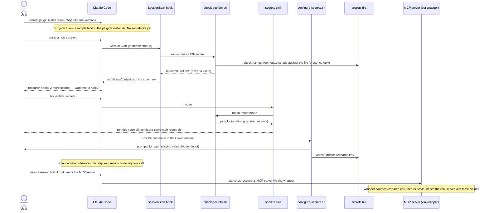

# Plugin secrets architecture

How MCP-server credentials and CLI-tool credentials get from "declared in
`bundles.yaml`" to "available to a running process" — without ever passing
through a model's own context, and without depending on which scope
(user/project) or version a plugin is installed at.

This document is the detailed companion to the GitHub issue that tracks the
work. It exists so the mechanism has one place that explains *why*, not just
*what* — read it before touching any of the pieces it describes.

## The problem this replaces

Before this design, a plugin's `.mcp.json` referenced `${VAR}` placeholders
that Claude Code resolved from its own process environment — the environment
inherited from whatever shell launched `claude`. Getting a value into that
shell required either exporting it by hand or sourcing
`essentials/scripts/load-env.sh` before every session. Two structural problems
followed from that:

- **Version bumps orphaned secrets.** A plugin's install path is version-pinned
  (`.../cache/<marketplace>/<plugin>/<version>/`), so a filled-in `.env` sitting
  next to that version's `.mcp.json` was abandoned the moment the plugin
  updated.
- **Nothing carried values into the process automatically.** Forgetting to
  source `load-env.sh` in a given terminal meant every `${VAR}` resolved to
  empty, silently.

## The five pieces

| Piece | Job | Lives in | Who/what runs it |
|---|---|---|---|
| **Stable secrets file** | Holds real values, one file per plugin, keyed by plugin *name* only | `~/.claude/indie-marketplace/secrets/<plugin>.env` | Read by the wrapper and the check script; written only by the configure script |
| **`.env.example`** | Documents which variable names a plugin needs | Generated by `build.py`, shipped inside each plugin's own install directory | Read by the check and configure scripts; a human can also read it directly |
| **MCP wrapper** | Loads a plugin's own secrets file, then launches the real server | Generated into each plugin's `.mcp.json` by `build.py` | Runs automatically every time Claude Code starts that MCP server |
| **`check-secrets.sh`** | One shared presence-check loop; two output modes | `essentials` plugin | Called by both the hook (quiet/JSON mode) and the secrets skill (report mode) |
| **`configure-secrets.sh`** | The only piece that ever asks for or writes a real value | `essentials` plugin | Run by the human, directly in their own terminal — never invoked by Claude's own tool calls |
| **`SessionStart` hook** | Runs the check on every session start, nudges if something's missing | `essentials` plugin | Fires automatically on `startup` (not on `clear`/`compact`) |
| **Secrets-management skill** | Named entry point: status, locate, point-to-setup, reset/delete | `essentials` plugin | Invoked by the user, or offered by Claude after the hook's nudge |

Why the stable file is keyed by plugin *name*, not version or install path:
that's the one property that makes it survive a plugin upgrade for free — no
migration step, no copy-forward logic, because the path never moves.

## Why `.env.example` didn't disappear

Its job changed, not its existence. It used to be "copy me to `.env` right
next to me" — a manual step tied to one specific (versioned) install path.
Now the configure script reads it programmatically to know which names to
prompt for, and a human can still read it directly to see what a plugin
needs. It's documentation and a machine-readable name list; it's never
hand-copied anymore.

## Why there's no single mechanism that "just works" for every runtime

Most MCP servers are launched as `npx`, `uvx`, `node`, `python`, or a plain
binary. For all of these, the wrapper is:

```bash
set -a; . "$SECRETS_FILE" 2>/dev/null; set +a; exec <real-command> <real-args>
```

`exec` replaces the wrapping shell's program with the real one *in the same
process*, so the environment `source` just populated carries straight over —
this works identically regardless of which language runtime the real command
happens to be.

**Docker is the one real exception.** A container does not inherit the host
shell's environment automatically — this repo has already hit that fact and
solved it, in the `database` plugin's `pgquery` and `dbtools` servers, which
pass values with explicit `-e NAME=value` / `-v` flags rather than relying on
inheritance. The wrapper for a `docker`-based server has to do the same thing,
just reading from the just-sourced shell variable instead of from Claude
Code's own `${VAR}` substitution:

```bash
set -a; . "$SECRETS_FILE" 2>/dev/null; set +a
docker run -i --rm -e DATABASE_URI="$DATABASE_PGQUERY_URI" crystaldba/postgres-mcp --access-mode=restricted --transport=stdio
```

Same source-then-launch shape; the `docker` branch of `build.py`'s codegen
just has to emit explicit `-e`/`-v` flags instead of a bare `exec`.

**Bare CLI credentials** (an `env:`-only declaration with no MCP server behind
it — a credential a skill's own script drives directly) have no launch point
to hook a wrapper into at all. The convention there is a one-line opt-in any
such script must start with:

```bash
set -a; . "$SECRETS_FILE" 2>/dev/null; set +a
```

documented once in `bundles.yaml`'s header. This is the one place automation
can't fully cover — a convention, not a mechanism.

## Why collision detection went away entirely

The old `load-env.sh` had to check every installed plugin's `.env` for
duplicate bare variable names, because it merged all of them into one shared
shell environment before Claude even started. In this design, nothing ever
does that merge — a wrapper sources exactly its own plugin's file; a CLI
script sources exactly its own plugin's file. There's no longer a moment
where two plugins' variables could collide, so the check isn't a smaller
version of the old one — it doesn't need to exist. `bundles.yaml`'s
per-plugin name-prefix rule survives as a readability convention, not a
correctness requirement.

## The end-to-end flow



## What this does *not* guarantee

- **"Claude never reads the secrets" is a policy guarantee, not a technical
  one.** It holds because the secrets skill's own instructions forbid it from
  invoking `configure-secrets.sh` itself. Claude Code has no tool-call mode
  where a model dispatches a command but is structurally blind to its stdout.
  If a future edit removed that instruction, the value would flow through the
  transcript like any other command output.
- **No per-project secret overrides.** The stable file is one value set per
  plugin, machine-wide. A project needing a different value for the same
  plugin is out of scope for this design. If that need shows up for real, it
  slots in as an additional check the resolver does *before* the stable
  default — without touching the wrapper mechanism.
- **Unix shells only.** `bash`, `source`, `exec` — consistent with the
  `env`/`docker` patterns this marketplace already ships elsewhere. Not a new
  assumption, just an inherited one.
